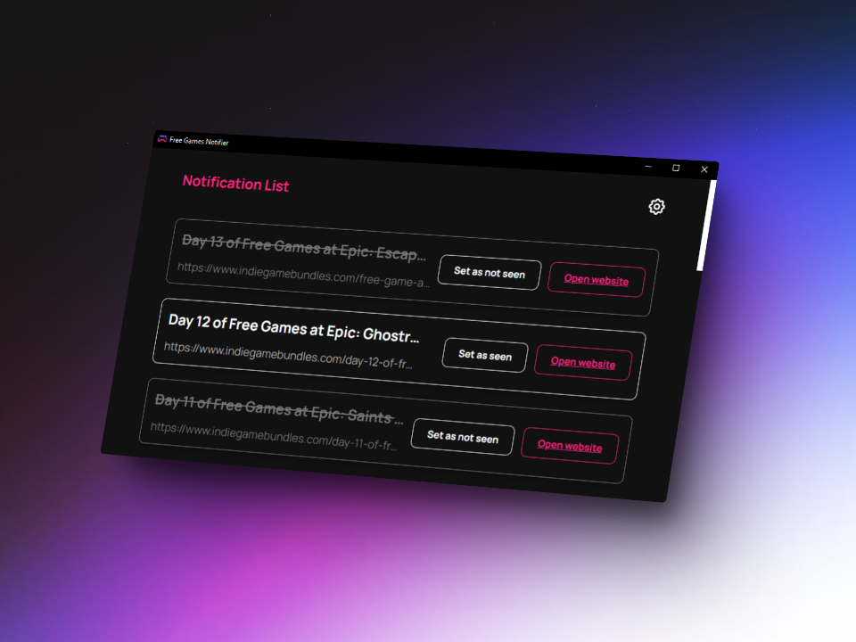

<h3 align="center"></h3>
<h1 align="center">Free Games Notifier</h1>
<p align="center">Desktop app that notifies you when a free game is available</p>
<br/>
<h2>Installation</h2>
<p>Download the <a href="https://github.com/JayexDesigns/free-games-notifier/releases/">latest release</a> for your platform or compile the source code from the root folder with the build command if <a href="https://nodejs.org/">Node.js</a> and <a href="https://www.rust-lang.org/">Rust</a> are installed.</p>

```bash
npm run tauri build
```

<h2>Use</h2>
<p>Once installed, you just have to open the application, it will start working in the background and notify you when a game is available for free. Closing the application will keep it running in the background, to really finish its execution you can press the "Exit" button in the system tray menu or within the application press the gear icon and select "Exit".</p>

